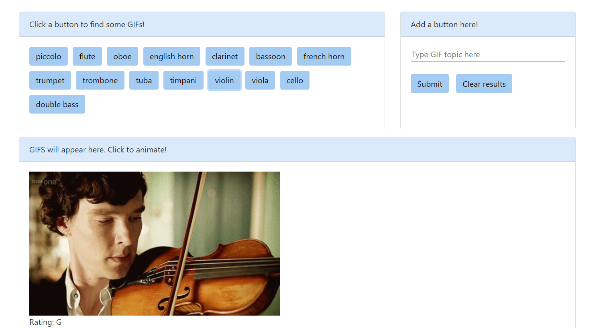

# GIPHY-API-app

## Coding Bootcamp Project

This is a web application which uses the GIPHY API. Buttons to query the API are auto-generated from an array of pre-coded topics,
and the user is able to type in their own topics and create more buttons. Clicking a button sends an AJAX request to the GIPHY API with a query as the topic in the button, and returns 10 GIFS along with their rating. GIFS appear still on load, but when clicked they start playing. Clicking the GIF again will stop the play and return to the still GIF.

Screenshot:

